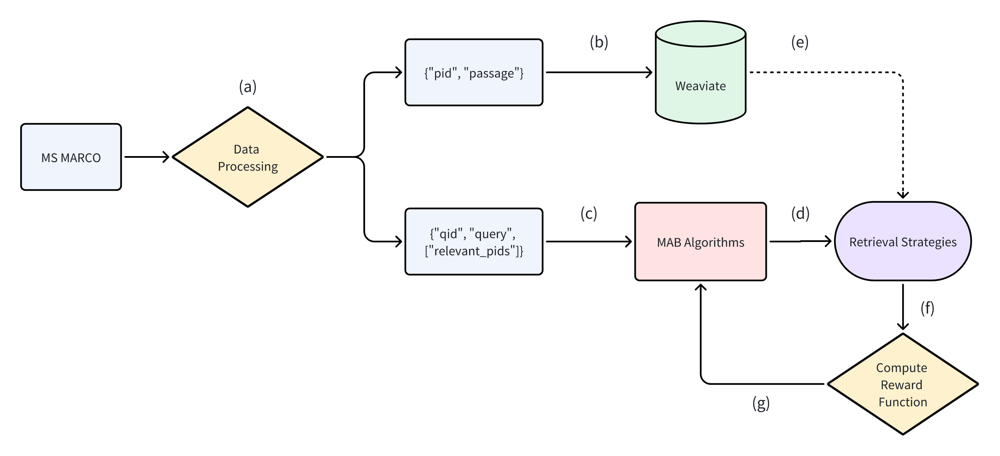

# 🤖 Multi-Armed Bandits for Adaptive Retrieval

## 🌟 Project Overview



**Experimental pipeline:**

<ol type="a">
  <li>Preprocessing</li>
  <li>Database ingestion</li>
  <li>Query streaming</li>
  <li>Arm selection</li>
  <li>Retrieval</li>
  <li>Reward computation</li>
  <li>Policy update</li>
</ol>

## 🎯 Getting Started

1. Clone Repository

    `cd` into your desired directory and then run the following command to clone the repo.

    ```bash
    git clone https://github.com/zzhenjie01/dsa4213-assignments.git
    ```

2. Install Python Packages

    We are using `uv` as our Python installation and package manager as it is extremely fast and resolves dependencies better that other package manager such as `pip`. [uv installation link](https://docs.astral.sh/uv/getting-started/installation/)

    For devices without NVIDIA GPU (including Macs) run the following command to install the necessary packages which includes PyTorch CPU-only 

    ```bash
    uv sync --extra cpu
    ```

    For devices with NVIDIA GPU, run the following command to install the necessary packages.

    ```bash
    uv sync --extra cu128
    ```

## 🐳 Docker Setup

For this project we are using Weaviate hosted locally via Docker to serve retrieval requests. Install [Docker](https://www.docker.com/products/docker-desktop/) first before proceeding. Make sure Docker is running in the background. Then run the following commands to pull the Weviate container and start running it.

```bash
cd docker
```

```bash
docker compose --project-name mab-retrieval up -d
```

## 💾 Get Datasets

The datasets we are using for this project are MS MARCO and Natural Questions.

### MS MARCO

1. Go to [MS MARCO website](https://microsoft.github.io/msmarco/Datasets.html) and download the `collection.tar.gz`, `queries.tar.gz`, and `qrels.dev.tsv`.
2. Extract `collection.tar.gz` and `queries.tar.gz` to get `collection.tsv` and `queries_dev.tsv` respectively.
3. Rename `qrels.dev.tsv` to `qrels_dev.tsv`
4. Place `collection.tsv`, `queries_dev.tsv`, and `qrels_dev.tsv` at `data/ms_marco/raw/`

### Natural Questions

1. Go to [BEIR HuggingFace](https://huggingface.co/datasets/BeIR/nq/tree/main) and download `corpus.jsonl.gz` and `queries.jsonl.gz`.
2. Go to [BEIR HuggingFace](https://huggingface.co/datasets/BeIR/nq-qrels/tree/main) and download `test.tsv`.
3. Extract `corpus.jsonl.gz` and `queries.jsonl.gz` to get `corpus.jsonl` and `queries.jsonl` respectively.
4. Put `corpus.jsonl`, `queries.jsonl`, and `test.tsv` at `data/nq/raw`

## 🧰 Data Preprocessing

Run all cells in the following notebooks to perform data preprocessing 

- `src/data_preprocessing_msmarco.ipynb`
- `src/data_preprocessing_nq.ipynb`

## 💽 Data Ingestion

Run the following scripts to ingest both datasets into Weaviate DB. Make sure Docker and the Weaviate container is running in the background before running these scripts.

```bash
python src/data_ingestion_msmarco.py
```

```bash
python src/data_ingestion_nq.py
```

## 🖥️ MAB Training

Run the following commands to perform the different experiments with different hyperparameters and datasets.

### Static Baseline Retrievals

**MS MARCO:**

```bash
python src/run_static_baselines.py --metric recall --dataset_name ms_marco
```

**Natural Questions:**

```bash
python src/run_static_baselines.py --metric recall --dataset_name nq
```

### Epsilon-Greedy Algorithm

**MS MARCO:**

```bash
python src/train_epsilon_greedy.py --epsilons 0.01 0.1 0.3 --lambda_param 0.5 --metric recall --seed 42 --dataset_name ms_marco
```

```bash
python src/train_epsilon_greedy.py --epsilons 0.1 --lambda_param 0.1 --metric recall --seed 42 --dataset_name ms_marco
```

```bash
python src/train_epsilon_greedy.py --epsilons 0.1 --lambda_param 0.9 --metric recall --seed 42 --dataset_name ms_marco
```

**Natural Questions:**

```bash
python src/train_epsilon_greedy.py --epsilons 0.01 0.1 0.3 --lambda_param 0.5 --metric recall --seed 42 --dataset_name nq
```

```bash
python src/train_epsilon_greedy.py --epsilons 0.1 --lambda_param 0.1 --metric recall --seed 42 --dataset_name nq
```

```bash
python src/train_epsilon_greedy.py --epsilons 0.1 --lambda_param 0.9 --metric recall --seed 42 --dataset_name nq
```

### Upper Confidence Bound (UCB) Algorithm

**MS MARCO:**

```bash
python src/train_ucb.py --c_values 1.0 2.0 3.0 --lambda_param 0.5 --metric recall --seed 42 --dataset_name ms_marco
```

```bash
python src/train_ucb.py --c_values 2.0 --lambda_param 0.1 --metric recall --seed 42 --dataset_name ms_marco
```

```bash
python src/train_ucb.py --c_values 2.0 --lambda_param 0.9 --metric recall --seed 42 --dataset_name ms_marco
```

**Natural Questions:**

```bash
python src/train_ucb.py --c_values 1.0 2.0 3.0 --lambda_param 0.5 --metric recall --seed 42 --dataset_name nq
```

```bash
python src/train_ucb.py --c_values 2.0 --lambda_param 0.1 --metric recall --seed 42 --dataset_name nq
```

```bash
python src/train_ucb.py --c_values 2.0 --lambda_param 0.9 --metric recall --seed 42 --dataset_name nq
```

### Empirical Gaussian Thompson Sampling Algorithm

**MS MARCO:**

```bash
python src/train_thompson.py --lambda_param 0.5 --metric recall --seed 42 --dataset_name ms_marco
```

```bash
python src/train_thompson.py --lambda_param 0.1 --metric recall --seed 42 --dataset_name ms_marco
```

```bash
python src/train_thompson.py --lambda_param 0.9 --metric recall --seed 42 --dataset_name ms_marco
```

**Natural Questions:**

```bash
python src/train_thompson.py --lambda_param 0.5 --metric recall --seed 42 --dataset_name nq
```

```bash
python src/train_thompson.py --lambda_param 0.1 --metric recall --seed 42 --dataset_name nq
```

```bash
python src/train_thompson.py --lambda_param 0.9 --metric recall --seed 42 --dataset_name nq
```

## 🔎 Results Visualization

Run the following notebooks to visualize the results from the training.

- `src/visualization_msmarco.ipynb`
- `src/visualization_nq.ipynb`
